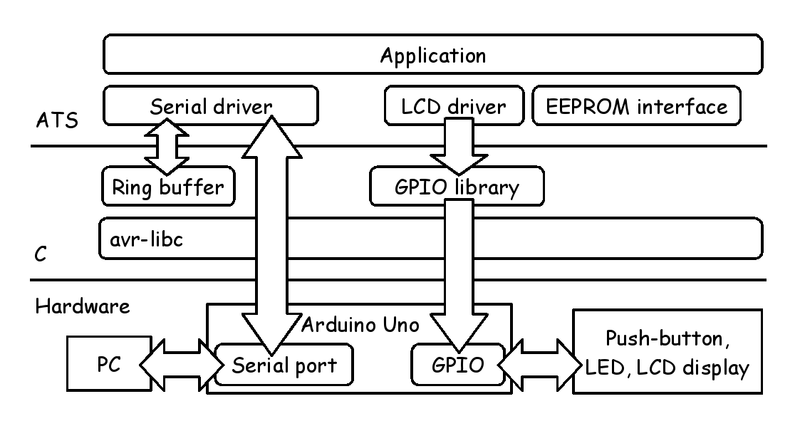
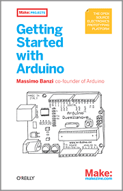
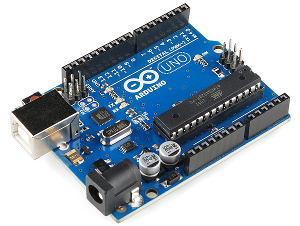

# ATS programing on Arduino [](https://travis-ci.org/fpiot/arduino-ats)

## Paper

Kiwamu Okabe and Hongwei Xi. [Arduino programing of ML-style in ATS](http://www.metasepi.org/doc/metasepi-icfp2015-arduino-ats.pdf). [ML workshop, 2015](http://www.mlworkshop.org/ml2015).

## Application Design



## Demo code

### Greating on LCD display

[](https://www.youtube.com/watch?v=5uPue0Jo1nc)

Show greeting message on LCD display that is available at [LinkSprite](http://store.linksprite.com/linksprite-16x2-lcd-keypad-shield-for-arduino-version-b/). The source code is found at [demo/lcd_greeting/DATS/main.dats](./demo/lcd_greeting/DATS/main.dats).

### Examples on Book "Getting Started with Arduino"

This project includes ATS code for [Book "Getting Started with Arduino"](http://shop.oreilly.com/product/9780596155520.do).

[](http://shop.oreilly.com/product/9780596155520.do)

The ATS code is found at following.

* [Example 01: Blinking LED](./demo/01_blink/DATS/main.dats)
* [Example 02: Turn on LED while the button is pressed](./demo/02_button_press/DATS/main.dats)
* [Example 03C: Turn on LED when the button is pressed](./demo/03_de_bouncing/DATS/main.dats)
* [Example 04: Fade an LED in and out like on a sleeping Apple computer](./demo/04_pwm/DATS/main.dats)
* [Example 05: Turn on LED when the button is pressed. Brightness changes](./demo/05_pwm_button/DATS/main.dats)
* [Example 06A: Blink LED at a rate specified by the value of the analogue input](./demo/06a_analoginput_blink/DATS/main.dats)
* [Example 06B: Set the brightness of LED to a brightness specified by the value of the analogue input](./demo/06b_analoginput_pwm/DATS/main.dats)
* [Example 07: Send to the computer the values read from analogue input 0](./demo/07_analoginput_serial/DATS/main.dats)

## Hardware: [Arduino Uno](http://arduino.cc/en/Main/ArduinoBoardUno)

[](http://arduino.cc/en/Main/ArduinoBoardUno)

* CPU: ATmega328 ([Atmel AVR](http://www.atmel.com/products/microcontrollers/avr/) 8-bit)
* Flash ROM: 32 kB
* SRAM: 2 kB

Also you could get [compatible boards](http://www.sainsmart.com/arduino/control-boards/sainsmart-uno-atmega328p-pu-atmega8u2-microcontroller-for-arduino.html)


## Setup environment

### [Debian GNU/Linux](https://www.debian.org/)

Install some packages.

```
$ sudo apt-get install binutils-avr gcc-avr avr-libc avrdude libgmp-dev
```

### Mac OS X

Install gmp package.

```
$ brew install gmp
```

Install AVR toolchain http://www.obdev.at/products/crosspack/index.html, and set PATH env.

```
$ export PATH=$PATH:/usr/local/CrossPack-AVR/bin
$ which avr-gcc
/usr/local/CrossPack-AVR/bin/avr-gcc
```

### Windows

Install following package on [cygwin](https://www.cygwin.com/).

* git
* gcc-core
* libgc-devel
* libgmp-devel
* make

Install AVR toolchain http://winavr.sourceforge.net/.

T.B.D.


## How to build

Install ATS2 http://www.ats-lang.org/.

```
$ tar xf ATS2-Postiats-X.Y.Z.tgz
$ export PATSHOME=`pwd`/ATS2-Postiats-X.Y.Z
$ export PATH=${PATSHOME}/bin:${PATH}
$ tar xf ATS2-Postiats-contrib-X.Y.Z.tgz
$ export PATSHOMERELOC=`pwd`/ATS2-Postiats-contrib-X.Y.Z
$ cd ${PATSHOME}
$ ./configure
$ make
```

Compile the ATS source code for Arduino.

```
$ cd arduino-ats/01_blink
$ make
$ file main.elf main.hex
main.elf: ELF 32-bit LSB executable, Atmel AVR 8-bit, version 1 (SYSV), statically linked, not stripped
main.hex: ASCII text, with CRLF line terminators
```


## Write to the flash

Connect Arduino board to your PC using USB cable.
And run following commands.

```
$ ls -l /dev/ttyACM0
crw-rw---- 1 root dialout 166, 0 May  8 15:59 /dev/ttyACM0
$ cd arduino-ats/blink_ats
$ make write
avrdude -c stk500v2 -p atmega2560 -b 115200 -P /dev/ttyACM0 -U flash:w:main.hex
avrdude: AVR device initialized and ready to accept instructions
Reading | ################################################## | 100% 0.01s
--snip--
avrdude: verifying ...
avrdude: 2850 bytes of flash verified
avrdude: safemode: Fuses OK (E:00, H:00, L:00)
avrdude done.  Thank you.
```


## How to debug using gdb

[](http://www.atmel.com/tools/avrdragon.aspx)

T.B.D.
