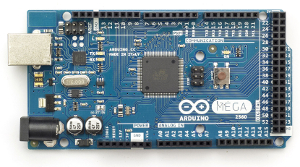

ATS programing on Arduino
=========================

## Hardware: [Arduino Mega 2560](http://arduino.cc/en/Main/ArduinoBoardMega2560)

[](http://arduino.cc/en/Main/ArduinoBoardMega2560)

* CPU: ATmega2560 ([Atmel AVR](http://www.atmel.com/products/microcontrollers/avr/) 8-bit)
* Flash ROM: 256 KiB
* SRAM: 8 KiB

Also you could get [compatible boards](http://www.sainsmart.com/sainsmart-mega2560-r3-development-board-compatible-with-arduino-mega2560-r3.html).

## How to build

Get your own [Debian GNU/Linux](https://www.debian.org/) PC.
Install some packages.

```
$ sudo apt-get install binutils-avr gcc-avr avrdude
```

Install ATS2 http://www.ats-lang.org/.

```
$ wget http://downloads.sourceforge.net/project/ats2-lang/ats2-lang/ats2-postiats-0.0.8/ATS2-Postiats-0.0.8.tgz
$ tar xf ATS2-Postiats-0.0.8.tgz
$ cd ATS2-Postiats-0.0.8
$ ./configure
$ make
$ sudo make install
$ export PATSHOME=/usr/local/lib/ats2-postiats-0.0.8
```

Compile the ATS source code for Arduino.

```
$ cd arduino-mega2560-ats/blink_ats
$ make
$ file main.elf main.hex
main.elf: ELF 32-bit LSB executable, Atmel AVR 8-bit, version 1 (SYSV), statically linked, not stripped
main.hex: ASCII text, with CRLF line terminators
```

## Write to the flash

Connect Arduino board to your PC using USB cable.
And run following commands.

```
$ ls -l /dev/ttyACM0
crw-rw---- 1 root dialout 166, 0 May  8 15:59 /dev/ttyACM0
$ cd arduino-mega2560-ats/blink_ats
$ make write
avrdude -c stk500v2 -p atmega2560 -b 115200 -P /dev/ttyACM0 -U flash:w:main.hex
avrdude: AVR device initialized and ready to accept instructions
Reading | ################################################## | 100% 0.01s
--snip--
avrdude: verifying ...
avrdude: 2850 bytes of flash verified
avrdude: safemode: Fuses OK (E:00, H:00, L:00)
avrdude done.  Thank you.
```

## How to debug using gdb

T.B.D.
